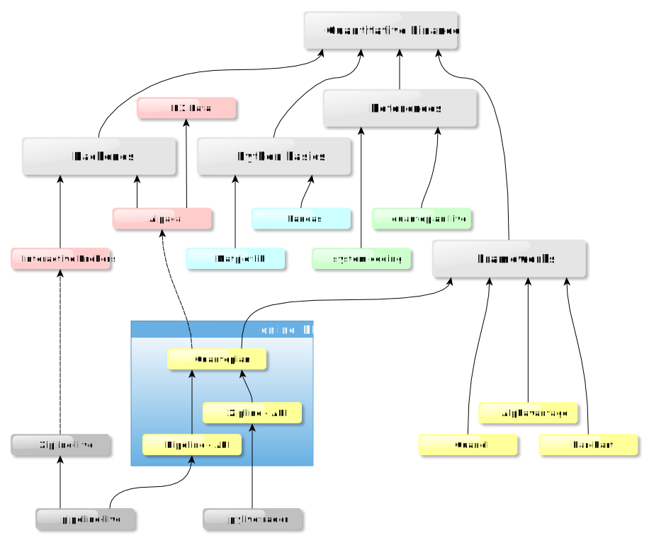

# Intro
* hello world getting started examples for quantitative finance analysis and beyond
* research targetting open source sw and free licenses usage

## gitignored files
Some files are critical and can contain confidential information like your keys or data you obtain with a specific license. These files mut be ignored by the versioning control here git, so have to be created manually.
* create a file "./api_key.json" with the content similar to     { "alphavantage":"Your_Key_here"}
* create a "./data/" directory where all manually downloaded csv files can be placed

# Mindmap

# Basics Frameworks
* Python is the primary language, although it is not excluded that accelerated computing or front end display switches to another language.
* Matplotlib and Pandas are basics for data analysis that go beyond finance and are quite common in every field (robotics, machine learning,...).
* Dash, new commer with revolutionary model, stepping over giant frameworks (plotly, d3.js, React, Flask) allows python complete webapps generation.
## Matplotlib
* https://matplotlib.org/users/legend_guide.html
## Pandas
* https://pandas.pydata.org/
## dash
* https://dash.plot.ly/installation

## VSCode
* I do run jupyter code cells directly from VSCode python editor which is a great experience, see more on https://code.visualstudio.com/docs/python/jupyter-support

# Finance Frameworks

## Alpha Vantage (./alpha/)
* (+) Alpha vantage is a very simple url query based API
* (+) API Key is very easy to obtain immidiatley

Official documentation : https://www.alphavantage.co/documentation/

## Local CSV (./local_csv/)
* Most of the data analysis is based on data history that is easy to obtain on csv format for long term analysis, therefore loading csv locally is a common to multiple data sources
* https://finance.yahoo.com/ is an excellent source to download csv files

## quandl (./quandl/)
* (+) Very nice exprience all in all
* (+) API key easy to obtain
* (-) as soon as it gets fun, you realise that the interesting data are actually premium
### quandl Examples
* min_quandl.py : you have to edit the file to replace your api key. Minimal nuber of lines to get data filter some years and plot
* test_quandl.py : loads the key from the api_key.json, some more diagnosis of types and data format
* dual_axis.py : how to display two data frames on the same plot, with each its own axis on left and right side

# Untested Finance Frameworks

## Quantopian
Although Quantopian is a very neat platform, it won't have the focus as it's constrained to an closed online ide. Some open source extentions exist, still to be evaluated.
* https://www.quantopian.com/
* Zipline backtesting engine for Quantopian https://www.zipline.io/
* convert from Quantopian and run live https://github.com/alpacahq/pylivetrader/
* run an independent pipeline https://github.com/alpacahq/pipeline-live/
* data source https://docs.alpaca.markets/
* not yet supported IB

## Real time event stream
    curl -v "https://proxy.streamdata.io/http://stockmarket.streamdata.io/prices/"

## Barchart
requires request and email exchange https://www.barchart.com/ondemand/api

# Finance Analysis Examples
3d "plotly dash" NY Times Yield curve
* https://www.nytimes.com/interactive/2015/03/19/upshot/3d-yield-curve-economic-growth.html

"plotly dash" NY Times Recession - Jobs
* https://www.nytimes.com/interactive/2014/06/05/upshot/how-the-recession-reshaped-the-economy-in-255-charts.html

# Useful links to get started with Finance
* https://www.investopedia.com/university/systemcoding/
* https://www.investopedia.com/investing/complete-guide-choosing-online-stock-broker/
* https://www.quantshare.com/sa-620-10-new-ways-to-download-historical-stock-quotes-for-free
* https://iextrading.com/developer/docs/
* https://www.interactivebrokers.co.uk/
* https://hackernoon.com/python-library-to-run-quantopian-algorithm-in-live-5a2d6025dd45
* https://www.investopedia.com/investing/complete-guide-choosing-online-stock-broker/

